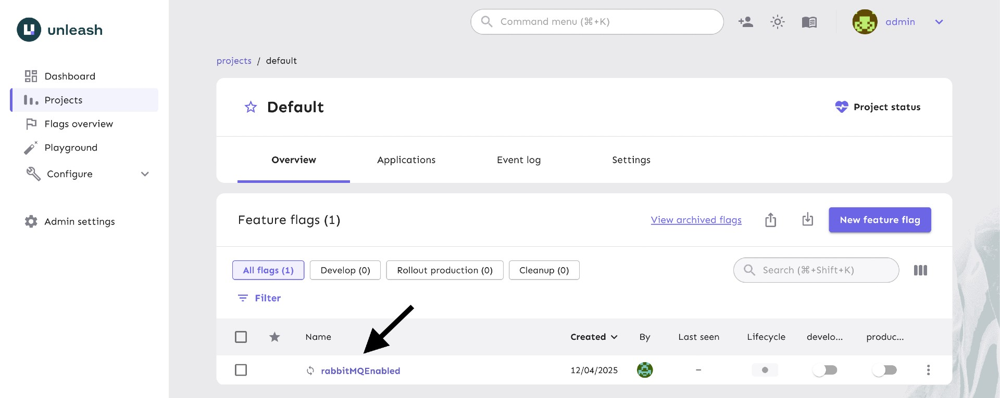

# springboot-activemq-rabbitmq-delayed-messages

The goal of this project is to create an application that produces and consumes delayed messages randomly. Those messages are sent to `ActiveMQ` or `RabbitMQ`. The delayed broker to which the message is sent depends on a feature toggle defined in `Unleash`.

## Proof-of-Concepts & Articles

On [ivangfr.github.io](https://ivangfr.github.io), I have compiled my Proof-of-Concepts (PoCs) and articles. You can easily search for the technology you are interested in by using the filter. Who knows, perhaps I have already implemented a PoC or written an article about what you are looking for.

## Project diagram


## Applications

`delayed-message-producer-consumer` is a [Spring Boot](https://docs.spring.io/spring-boot/index.html) Java application that produces and consumes messages with random delays.

These delayed messages are sent to [`ActiveMQ`](https://activemq.apache.org/) or [`RabbitMQ`](https://www.rabbitmq.com/) brokers.

However, both brokers are not ready to handle delayed messages by default. For it, we needed to enable the scheduler in `ActiveMQ` and, in `RabbitMQ`, we install the [Delayed Message Plugin](https://github.com/rabbitmq/rabbitmq-delayed-message-exchange/).

Furthermore, in order to easily switch the delayed message broker to where the messages are sent without restarting the application, we use a feature toggle called `rabbitMQEnabled` that is defined in [`Unleash`](https://www.getunleash.io/).

## Prerequisites

- [`Java 21`](https://www.oracle.com/java/technologies/downloads/#java21) or higher;
- A containerization tool (e.g., [`Docker`](https://www.docker.com), [`Podman`](https://podman.io), etc.)

## Initialize Environment

Open a terminal and inside the `springboot-activemq-rabbitmq-delayed-messages` root folder run:
```bash
./init-environment.sh
```
> **Note**: This script not only starts `ActiveMQ`, `RabbitMQ`, `Unleash`, and `Postgres` but also creates a feature toggle called `rabbitMQEnabled` in `Unleash`.

## Running application with Maven

- In a terminal, make sure you are inside the `springboot-activemq-rabbitmq-delayed-messages` folder.
- Run the following command:
  ```bash
  ./mvnw clean spring-boot:run --projects delayed-message-producer-consumer \
    -Dspring-boot.run.jvmArguments="-Dunleash.api.key='*:development.some-random-string'"
  ```
  > **Note**: the `UNLEASH_API_KEY` was created during the step [Initialize Environment](#initialize-environment)

## Running application as Docker container

- ### Build Docker image

  - In a terminal, make sure you are inside the `springboot-activemq-rabbitmq-delayed-messages` root folder.
  - Run the following script:
    ```bash
    ./build-docker-images.sh
    ```

- ### Environment variables
  
| Environment Variable       | Description                                                                 |
|----------------------------|-----------------------------------------------------------------------------|
| `ACTIVEMQ_BROKER_URL`      | Specify URL of the ActiveMQ broker to use (default `tcp://localhost:61616`) |
| `ACTIVEMQ_USER`            | Specify user of the ActiveMQ broker (default `admin`)                       |
| `ACTIVEMQ_PASSWORD`        | Specify password of the ActiveMQ broker (default `admin`)                   |
| `RABBITMQ_ADDRESSES`       | Specify addresses of the RabbitMQ broker to use (default `localhost:5672`)  |
| `RABBITMQ_USER`            | Specify user of the RabbitMQ broker (default `admin`)                       |
| `RABBITMQ_PASSWORD`        | Specify password of the RabbitMQ broker (default `admin`)                   |
| `UNLEASH_API_URL`          | Specify URL of the Unleash to use (default `http://localhost:4242/api`)     |
| `UNLEASH_API_KEY`          | Specify API key of the Unleash to use (default `change-me`)                 |
| `MESSAGES_PER_SECOND`      | Specify the number of messages per second to be produced (default `1`)      |
| `PRODUCER_RUNNER_ENABLED`  | Specify if producer runner is enabled to produce messages (default `true`)  |
| `PRODUCER_LOGGING_ENABLED` | Specify if producer logging is enabled (default `false`)                    |
| `CONSUMER_LOGGING_ENABLED` | Specify if consumer logging is enabled (default `true`)                     |

- ### Start Docker container

  - In a terminal, run the following command:
    ```bash
    docker run --rm --name delayed-message-producer-consumer \
      -e ACTIVEMQ_BROKER_URL=tcp://activemq:61616 \
      -e RABBITMQ_ADDRESSES=rabbitmq:5672 \
      -e UNLEASH_API_URL=http://unleash:4242/api \
      -e UNLEASH_API_KEY='*:development.some-random-string' \
      --network=springboot-activemq-rabbitmq-delayed-messages_default \
      ivanfranchin/delayed-message-producer-consumer:1.0.0
    ```
    > **Note**: the `UNLEASH_API_KEY` was created during the step [Initialize Environment](#initialize-environment)

  - \[Optional\] To start a 2nd Docker container, in another terminal, run the command below:
    ```bash
    docker run --rm --name delayed-message-producer-consumer-2 \
      -e ACTIVEMQ_BROKER_URL=tcp://activemq:61616 \
      -e RABBITMQ_ADDRESSES=rabbitmq:5672 \
      -e UNLEASH_API_URL=http://unleash:4242/api \
      -e UNLEASH_API_KEY='*:development.some-random-string' \
      --network=springboot-activemq-rabbitmq-delayed-messages_default \
      ivanfranchin/delayed-message-producer-consumer:1.0.0
    ```

## Switching Delayed Message Brokers

- Access the Unleash website at http://localhost:4242
- To log in, use `admin` as the username and `unleash4all` as the password.
- In `Projects`, select `Default`.
- You should see the `rabbitMQEnabled` feature toggle.
  
- The API token provided to `delayed-messages-producer-consumer` was created for the `development` environment. If the `development` checkbox is enabled, messages will be sent to `RabbitMQ`; otherwise, they will be sent to `ActiveMQ`.

## Useful links

- **ActiveMQ**

  - Access http://localhost:8161
  - Click `Manage ActiveMQ broker`.
  - To log in, use `admin` for both username and password.

- **RabbitMQ**

  - Access http://localhost:15672
  - To log in, use `admin` for both username and password.

- **Unleash**

  - Access http://localhost:4242
  - To log in, use `admin` as the username and `unleash4all` as the password.

## Shutdown

- To stop the `delayed-message-producer-consumer` application, go to the terminal where it is running and press `Ctrl+C`.
- To stop and remove Docker Compose containers, network and volumes, go to a terminal and, inside the `springboot-activemq-rabbitmq-delayed-messages` root folder, run the following command:
  ```bash
  ./shutdown-environment.sh
  ```
## Cleanup

To remove the Docker image create by this project, go to a terminal and, inside the `springboot-activemq-rabbitmq-delayed-messages` root folder, run the following script:
```bash
./remove-docker-images.sh
```
