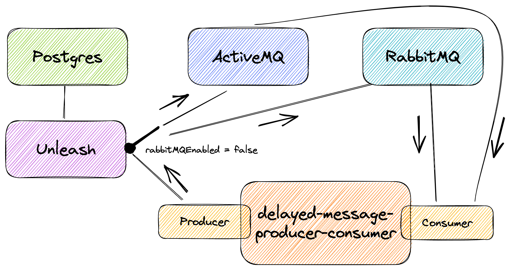

# springboot-activemq-rabbitmq-delayed-messages

The goal of this project is to create an application that produces and consumes messages with random delays. Those messages are sent and handled by delayed message brokers.

## Project diagram



## Applications

`delayed-message-producer-consumer` is a [Spring Boot](https://docs.spring.io/spring-boot/docs/current/reference/htmlsingle/) Java application that produces and consumes messages with random delays.

These delayed messages are sent to [`ActiveMQ`](https://activemq.apache.org/) or [`RabbitMQ`](https://www.rabbitmq.com/) brokers.

However, both brokers are not ready to handle delayed messages by default. For it, we needed to enable the scheduler in `ActiveMQ` and, in `RabbitMQ`, we install the [Delayed Message Plugin](https://github.com/rabbitmq/rabbitmq-delayed-message-exchange/).

Furthermore, in order to easily switch the delayed message broker to where the messages are sent without restarting the application, we use a feature toggle called `rabbitMQEnabled` that is defined in [`Unleash`](https://www.getunleash.io/).

## Prerequisites

- [`Java 17+`](https://www.oracle.com/java/technologies/downloads/#java17)
- [`Docker`](https://www.docker.com/)
- [`Docker-Compose`](https://docs.docker.com/compose/install/)

## Initialize Environment

Open a terminal and inside `springboot-activemq-rabbitmq-delayed-messages` root folder run
```
./init-environment.sh
```

## Configuring Unleash

- Access Unleash website at http://localhost:4242
- To login, type `admin` and `unleash4all` for username and password, respectively

### Create Unleash API Key

- On the main menu at the top, click `Configure` > `API Access`;
- Click `New API token` button;
- For the _Token name_ field, set `delayed-messages`;
- Keep the remaining fields as they are. This way, we will create a API token for the `development` environment;
- Click `Create token` button;
- The token will be used to run the application [with Maven](#running-application-with-maven) or [with Docker container](#running-application-as-docker-container);
- Click `Close` button.

### Create feature toggle

- On the main menu at the top, click `Feature toggles`;
- Click `New feature toggle` button;
- For the _Name_ field, set `rabbitMQEnabled`;
- Keep the remaining fields as they are;
- Click `Create feature toggle` button.

## Running application with Maven

- In a terminal, make sure you are inside `springboot-activemq-rabbitmq-delayed-messages` folder
- Export the Unleash API Key to the `UNLEASH_API_KEY` environment variable
  ```
  export UNLEASH_API_KEY=...
  ```
- Run the following command
  ```
  ./mvnw clean spring-boot:run --projects delayed-message-producer-consumer
  ```

## Running application as Docker container

- ### Build Docker image

  - In a terminal, make sure you are inside `springboot-activemq-rabbitmq-delayed-messages` root folder
  - Run the following script
    ```
    ./docker-build.sh
    ```

- ### Environment variables
  
| Environment Variable       | Description                                                                |
|----------------------------|----------------------------------------------------------------------------|
| `ACTIVEMQ_BROKER_URL`      | Specify URL of the ActiveMQ broker to use (default `tcp://localhost:61616`) |
| `ACTIVEMQ_USER`            | Specify user of the ActiveMQ broker (default `admin`)                      |
| `ACTIVEMQ_PASSWORD`        | Specify password of the ActiveMQ broker (default `admin`)                  |
| `RABBITMQ_ADDRESSES`       | Specify addresses of the RabbitMQ broker to use (default `localhost:5672`) |
| `RABBITMQ_USER`            | Specify user of the RabbitMQ broker (default `admin`)                      |
| `RABBITMQ_PASSWORD`        | Specify password of the RabbitMQ broker (default `admin`)                  |
| `UNLEASH_API_URL`          | Specify URL of the Unleash to use (default `http://localhost:4242/api`)    |
| `MESSAGES_PER_SECOND`      | Specify the number of messages per second to be produced (default `100`)   |
| `PRODUCER_RUNNER_ENABLED`  | Specify if producer runner is enabled to produce messages (default `true`) |
| `PRODUCER_LOGGING_ENABLED` | Specify if producer logging is enabled (default `false`)                   |
| `CONSUMER_LOGGING_ENABLED` | Specify if consumer logging is enabled (default `true`)                    |

- ### Start Docker container

  - In a terminal, set the Unleash API Key to the `UNLEASH_API_KEY` environment variable
    ```
    UNLEASH_API_KEY=...
    ```
  - Run the following command to start the Docker container
    ```
    docker run --rm --name delayed-message-producer-consumer \
      -e ACTIVEMQ_BROKER_URL=tcp://activemq:61616 \
      -e RABBITMQ_ADDRESSES=rabbitmq:5672 \
      -e UNLEASH_API_URL=http://unleash:4242/api \
      -e UNLEASH_API_KEY=$UNLEASH_API_KEY \
      --network=springboot-activemq-rabbitmq-delayed-messages_default \
      ivanfranchin/delayed-message-producer-consumer:1.0.0
    ```

  - \[Optional\] To start a 2nd Docker container
    - In another terminal, set the Unleash API Key to the `UNLEASH_API_KEY` environment variable
      ```
      UNLEASH_API_KEY=...
      ``` 
    - Run the following command
      ```
      docker run --rm --name delayed-message-producer-consumer-2 \
        -e ACTIVEMQ_BROKER_URL=tcp://activemq:61616 \
        -e RABBITMQ_ADDRESSES=rabbitmq:5672 \
        -e UNLEASH_API_URL=http://unleash:4242/api \
        -e UNLEASH_API_KEY=$UNLEASH_API_KEY \
        --network=springboot-activemq-rabbitmq-delayed-messages_default \
        ivanfranchin/delayed-message-producer-consumer:1.0.0
      ```

## Switching Delayed Message Brokers

- Access Unleash website at http://localhost:4242
- To login, type `admin` and `unleash4all` for username and password, respectively
- In the main page, you should see the `rabbitMQEnabled` feature toggle;
  
- The API token provided to `delayed-messages-producer-consumer`, was created to `development` environment. So, if the `development` checkbox is enabled, the messages will be sent to `RabbitMQ`; otherwise, they will go to `ActiveMQ`.

## Useful links

- **ActiveMQ**

  - Access http://localhost:8161
  - Click `Manage ActiveMQ broker`
  - To login, type `admin` for both username and password

- **RabbitMQ**

  - Access http://localhost:15672
  - To login, type `admin` for both username and password

- **Unleash**

  - Access http://localhost:4242
  - To login, type `admin` and `unleash4all` for username and password, respectively

## Shutdown

- To stop `delayed-message-producer-consumer` application, go to the terminal where it is running and press `Ctrl+C`
- To stop and remove docker-compose containers, network and volumes, go to a terminal and, inside `springboot-activemq-rabbitmq-delayed-messages` root folder, run the following command
  ```
  ./shutdown-environment.sh
  ```
## Cleanup

To remove the Docker image create by this project, go to a terminal and, inside `springboot-activemq-rabbitmq-delayed-messages` root folder, run the following script
```
./remove-docker-images.sh
```
